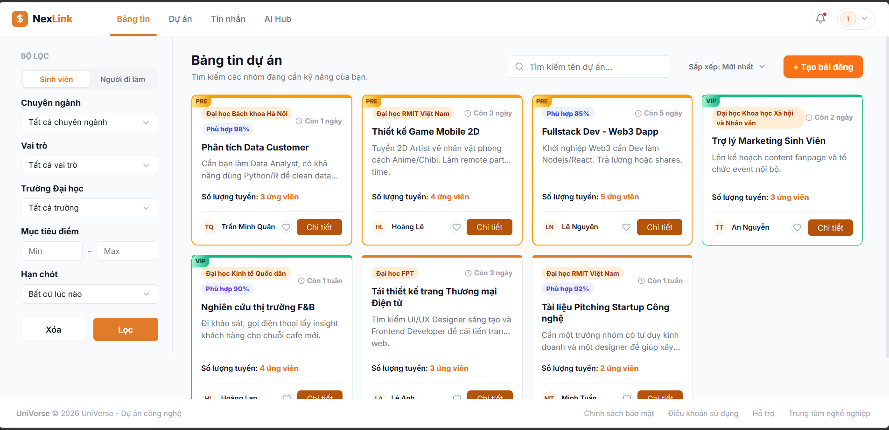
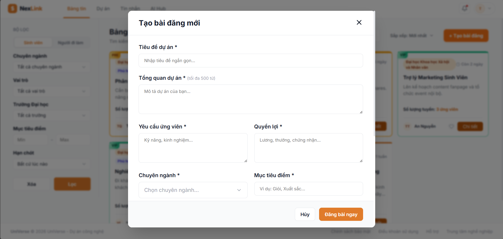
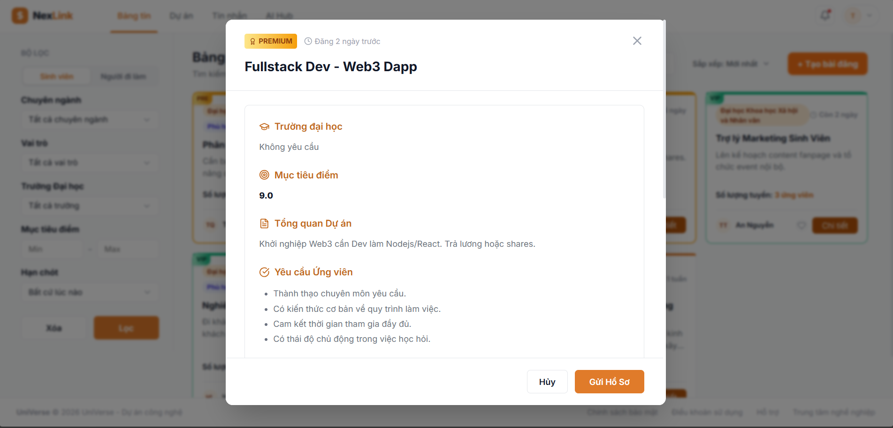
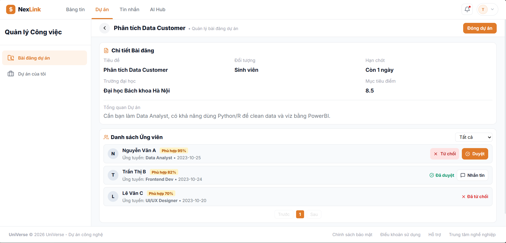
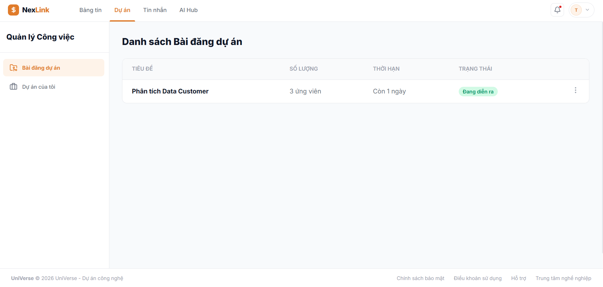
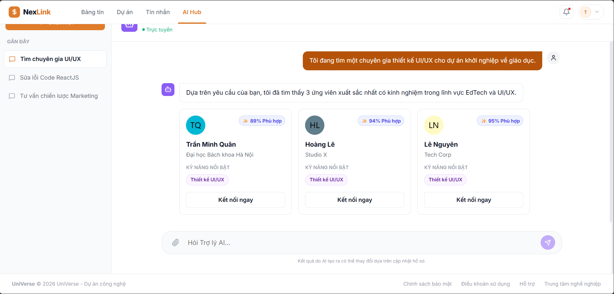

# Báo cáo Tài liệu Dự án: UniVerse AI

## 1. Giới thiệu Tổng quan

**UniVerse AI** là một nền tảng kết nối nhân sự và dự án công nghệ, được thiết kế để giải quyết bài toán tìm kiếm đồng đội, thành viên, cộng tác viên. Nền tảng hướng đến nhóm đối tượng chính: **Sinh viên** (cần tìm người làm đồ án, bài tập lớn, nghiên cứu khoa học và cần tham khảo các tài liệu học tập)

Đặc biệt, hệ thống tích hợp công nghệ AI (AI Hub) để hỗ trợ phân tích độ phù hợp của ứng viên và tối ưu hóa quá trình ghép nhóm và đồng thời tìm các tài liệu hỗ trợ cho việc học.

## 2. Các Vai trò (Roles) trong hệ thống

Hệ thống phân chia người dùng thành 2 nhóm đối tượng chính với các luồng hoạt động, các tính năng và bộ lọc filter hỗ trợ người dùng.

### 2.1. Sinh viên - Student

- **Mục tiêu:** Tìm kiếm đồng đội hoặc thành viên để tập hợp thành một nhóm làm bài tập lớn, đồ án tốt nghiệp, đồ án môn học hoặc tìm nhóm nghiên cứu dự án khoa học.
- **Đặc điểm:** Quan tâm đến trường đại học, [ chuyên ngành-chuyên ngành hẹp (chuyên ngành hẹp là những chuyên ngành con của "Chuyên ngành". Ví dụ : Chuyên ngành Thiết kế đồ họa gồm : chuyên ngành hẹp X, Y, Z, chuyên ngành Kỹ thuật phần mềm gồm : chuyên ngành hẹp NodeJS, Topic on Java, Kỹ sư cầu nối Nhật Bản....)] và có mục tiêu điểm số của dự án/đồ án hoặc phần thưởng trong các kỳ thi dự án.

### 2.2. Quản trị viên - Admin

- **Mục tiêu:** Quản trị dự án, xem báo cáo thống kê doanh thu, quản lý người dùng, giám sát và vận hành hệ thống, thống kê các data như : số môn học, file tài liệu upload, nội dung các file tài liệu.
- **Đặc điểm:** Quyền hạn tối cao, giao diện riêng biệt khác so với Student và có trách nhiệm bảo mật toàn vẹn thông tin và dữ liệu người dùng (users).

## 3. Luồng Hoạt động (User Flow)

### 3.1: Đăng nhập, Đăng ký & Quên mật khẩu (**Authentication - Authorization** ) và Thiết lập hồ sơ thông tin người dùng.

- Người dùng ĐĂNG NHẬP vào hệ thống:
  - Cách 1: Nhập đúng Email và Mật khẩu (có ẩn / hiện để thấy được mật khẩu mình nhập).
  - Cách 2: Đăng nhập bằng liên kết với Google.
- Người dùng ĐĂNG KÝ TÀI KHOẢN hệ thống:
  - Nhập Email, Mật khẩu và Xác nhận mật khẩu. Sau khi nhấn nút "Đăng ký tài khoản" sẽ có email tự động theo form gửi về chính Email người đăng ký kèm theo mã OTP (6 số) yêu cầu người dùng phải nhập xác nhận lại đúng mã OTP đó trên màn hình hệ thống để kích hoạt Tài khoản sẽ được tạo thành công và lưu trong hệ thống. Lưu ý : Mã OTP có thời hạn 5 phút kể từ khi gửi email.
- Người dùng QUÊN MẬT KHẨU hệ thống:
  - Nhập đúng địa chỉ Email và nhấn nút "Gửi mã xác nhận" sẽ có email tự động gửi về chính Email người đăng ký kèm theo mã OTP (6 số) yêu cầu người dùng phải nhập xác nhận lại đúng mã OTP đó trên màn hình hệ thống để kích hoạt chuyển sang màn hình ĐẶT LẠI MẬT KHẨU (gồm : Nhập mật khẩu mới và Xác nhận mật khẩu mới). Sau khi thành công sẽ tự động quay về trang ĐĂNG NHẬP hệ thống. Lưu ý : Mã OTP có thời hạn 5 phút kể từ khi gửi email.
- Người dùng THIẾT LẬP HỒ SƠ: Đây là phần bắt buộc sau khi qua bước ĐĂNG KÝ TÀI KHOẢN vào hệ thống.
  - Người dùng cần nhập đầy đủ thêm các thông tin theo các bước từ 1 đến 4
  - Bước 1 : Thông tin cá nhân : nhập Họ Tên, Số điện thoại, Địa chỉ,  Ngày sinh.
  - Bước 2 : Thông tin học tập :
    - chọn *Kỳ đang học (Drop List từ Kỳ 1 - Kỳ 9) và
    - chọn *Chuyên ngành (Drop List) mình học.
    - chọn *Chuyên ngành hẹp (Drop List danh sách các chuyên ngành hẹp tương ứng với Chuyên ngành đã chọn). Chuyên ngành hẹp chỉ hiện ra khi bạn chọn Kỳ học từ 5 trở lên. Bởi vì *Đại học FPT mặc định sinh viên bắt đầu vào Kỳ 5 mới cho chọn "Chuyên ngành hẹp".
  - Bước 3 : Hồ sơ năng lực :
    - *Kỹ năng chính : chọn Many2Many các kỹ năng chính như : Lập trình, Thiết kế, Marketing, Kinh doanh, Bảo mật, Quản lý, Khác .....
    - *Điểm mạnh (người dùng nhập) : ví dụ Thuyết trình, giải quyết vấn đề, chủ động đóng góp trong nhóm...
    - *Điểm yếu (người dùng nhập) : ví dụ Thiếu tự tin, Kỹ năng còn hạn chế...
    - *Lịch sử dự án : cho dạng dấu + và có 2 button Lưu và Xóa, mỗi lần người dùng click dấu + sẽ tạo mới để điền form thông tin. Dự án sẽ gồm 2 tab 'Dự án cá nhân' và 'Dự án nhóm'. Thông tin sẽ là dạng Popup gồm : *Tên dự án - Nhập, *Mô tả dự án - Nhập), *Thời gian tham gia (Bắt đầu - Kết thúc) - kiểu Date để chọn, *Vai trò (Droplist [Trưởng nhóm, Thành viên] - vai trò của người đó trong dự án đó ) và *Nhiệm vụ cụ thể (Nhập - mô tả họ làm gì trong dự án đó). Lưu ý *Vai trò và *Nhiệm vụ cụ thể chỉ hiển thị khi chọn tab 'Dự án nhóm'.
  - Bước 4 : Mục tiêu :
    - Mục tiêu điểm số : kéo range khoảng từ 0.0 đến 4.0.
  - Bước 5 : Nhập 4 bước xong sẽ có Step Indicator / Step Icon thể hiện các bước đã hoàn thiện. Bước cuối chỉ cần nhấn "Hoàn thiện hồ sơ". Lập tức sẽ xong hết tất cả và chuyển đến trang feed các dự án và feed các tài liệu học tập.

### 3.2: Khám phá Bảng tin dự án (Project Feed)

- Người dùng truy cập trang **Bảng tin dự án (/project-feed)**.
- Giao diện chia làm 2 phần chính:
  - **Div trái (Sidebar Filter) 20%:**
    - Chứa công cụ bộ lọc thông minh (được ghim cố định - sticky).
    - Bộ lọc gồm : Dropdown Chuyên ngành , Dropdown Chuyên ngành hẹp (Chuyên ngành hẹp sẽ hiển thị dạng list khi chúng ta đã chọn Chuyên ngành tương ứng, ví dụ : Chuyên ngành A sẽ có list gồm x chuyên ngành hẹp, Chuyên ngành B thì lại có list y chuyên ngành hẹp, hiển thị list các chuyên ngành hẹp tương ứng với chuyên ngành đã chọn). Mục tiêu điểm số (Range từ 0 - 10), Sắp xếp : theo mới nhất, cũ nhất, 7 ngày qua, 1 tuần qua, 1 tháng qua. Trạng thái (Còn tuyển và Đã đủ (liên quan đến số lượng ứng viên đã nộp hồ sơ vào bài đăng dự án đó) - type Radio) và 2 button đặt ngang nhau display flex gồm Xóa (Reset các bộ lọc về mặc định) và Lọc (Thực hiện chức năng lọc).
  - **Div phải (Project List) 80%:**
    - Danh sách các dự án : dạng Box dàn hàng ngang 4 card / 1 dòng và tổng là 20 cái trong 5 dòng buộc phải scroll đến cuối để có phân trang. Phân trang bắt buộc phải luôn là Trước 1... Sau , nếu có 1 trang mà chưa đủ 20 card bài đăng thì vẫn để Trước - 1 - Sau..
    - Project List gồm Title dạng cỡ chữ Hx (x có thể là 2,3,4 tùy ý) đặt ở top left cùng dòng với Filter tìm kiếm tên dự án  - kiểu Text input, filter Dropdown lọc "Mới nhất, Cũ nhất " và Button Tạo bài đăng ở top right - Tất cả đều đặt ngang hàng nhau và cùng trên 1 dòng, tuyệt đối không đặt theo chiều dọc.
    - Màn hình các Card bài đăng dự án :
      - Card hình vuông, có border góc cạnh nhẹ, hiệu ứng bo viền dạng màu đổ bóng nhẹ.
      - Card sẽ gồm Tên Chuyên ngành, Độ phù hợp x % - sẽ là thuật toán dựa trên những thông tin của người dùng có như cầu), Thời hạn ("Còn x ngày" - mô tả còn x ngày thì bài đăng sẽ tự động ẩn đi, kết thúc), Ngày đăng : kiểu Date, Tiêu đề dự án và Một chút đoạn description mô tả ngắn gọn, nếu dài thì cứ ghi 1-2 dòng rồi thêm 3 chấm cuối đoạn mô tả, Số lượng tuyển : X ứng viên, Số lượng còn lại : X - số lượng đã nộp hồ sơ sẽ ra giá trị của số lượng còn lại). Bên dưới sẽ gồm Icon Avatar Chủ bài đăng (Click vào sẽ ra đường link dẫn đến trang cá nhân của họ) và icon Tym (kiểu để like, tim giống Facebook sau này có thể vào hoạt động của người dùng để xem các bài đã thả tim) và Button "Chi tiết" (Click vào sẽ hiển thị popup chi tiết bài đăng dự án đó). Tham khảo ảnh dưới : 

### 3.3: Đăng tải Dự án mới (Create Post)

- Màn hình chi tiết tạo bài đăng khi người dùng click "Tạo bài đăng" - tương tự popup xem chi tiết nhưng có khác một chút về các thông tin gồm :

  - Tiêu đề dự án * : dạng text cho nhập nhưng giới hạn số lượng từ
  - Tổng quan dự án * : dạng text cho nhập nhưng giới hạn số lượng từ (tối đa x từ)
  - Yêu cầu ứng viên * dạng text cho nhập nhưng giới hạn số lượng từ (tối đa x từ)
  - Chuyên ngành *: dạng dropdown nhưng là kiểu many2many
  - Mục tiêu điểm * : khoảng range min 0 và max 10
  - Số lượng tuyển * : Number từ min = 1 đổ lên (validate không được phép là 0 và âm, kiểu Integer)
  - Chi tiết số lượng thành viên* : cho dạng number - text và dấu + thêm dòng đại diện cho số lượng : vị trí Ví dụ : 1 : Desginer, 2 : Frontend, 1 : Tester.... luôn validate min là 1 trở đi
  - Hạn ứng tuyển : Date - chọn ngày hết hạn để đóng tuyển thành viên
  - Nút Hủy (Quay lại list các dự án) và Đăng bài ngay (OnPress để hoàn thành tính năng đăng bài)
  - Tham khảo ảnh bên dưới: 

### 3.4: Xem chi tiết & Ứng tuyển

- Màn hình xem chi tiết bên trong một bài đăng:
  - Tên Chuyên ngành, Tên Chuyên ngành hẹp
  - Góc phải sát popup sẽ là Đăng x ngày trước và Thời hạn còn lại.
  - Mục tiêu điểm : Target của dự án người chủ bài đăng đề ra.
  - Tổng quan dự án : Description mô tả dự án (thẻ Card lấy từ cái này để làm mô tả)
  - Yêu cầu ứng viên : các gạch đầu dòng nhập mô tả yêu cầu ứng viên
  - Chi tiết số lượng thành viên : ví dụ X data analyst, Y frontend, Z tester. Tổng số lượng tuyển chính là X + Y + Z hiển thị ở Card.
  - Form Nộp Hồ Sơ ứng tuyển : đường link upload file (Max 2mb)
  - Text ghi chú : Người dùng nhập ghi chú + upload CV để OnPress gửi hồ sơ đến cho Chủ bài đăng đó rồi đợi họ duyệt.
  - Nút Hủy (tắt màn hình popup và trở về trang list danh sách dự án đó) và Gửi hồ sơ (Chức năng gửi yêu cầu ứng tuyển).
  - Tham khảo ảnh bên dưới:

### 3.5: Kết nối cộng đồng

- Người dùng có thể gõ tìm kiếm trên thanh search của Tab "Cộng đồng" trên Navbar dự án để tìm kiếm tên người dùng để vào trang cá nhân của họ rồi xem các thông tin cơ bản và có thể theo dõi và nhắn tin liên hệ (liên quan đến phần 3.6)

### 3.6: Tin nhắn & Kết nối (Messaging)

- Gồm 2 tab "Cá nhân" dùng để trao đổi 1 vs 1 giữa mọi người và tab "Nhóm" dùng để trao đổi khi đã thành lập nhóm từ 3 người trở lên.
- Người dùng có thể nhắn tin khi muốn kết bạn/theo dõi hoặc kết nối, người dùng trao đổi qua tính năng **Tin nhắn (/messages)**.
- Người dùng có nhắn tin trực tiếp trao đổi và trò chuyện với họ trên trang cá nhân của họ thông qua việc click "Nhắn tin". Sau khi nhắn tin thì sẽ có cuộc trò chuyện trong tab "Tin nhắn" của Navbar.
- Hai người cũng có thể trò chuyện tương tác trực tiếp song song với nhau, đoạn chat có thể gửi được ảnh, upload file thì thiết bị, có các tính năng tìm kiếm đoạn nội dung của đoạn chat, tắt thông báo để không hiển thị icon Số thông báo và xóa cuộc trò chuyện
- Người dùng cũng có thể mời các thành viên khi đã join vào dự án tuyển, chủ (leader) dự án sẽ mời mọi người và thành lập nhóm, có thể trao đổi trực tiếp trong nhóm.

### 3.7: Quản lý Dự án cá nhân (Manage Projects)

- Trang **Quản lý Dự án (/manage)** dạng bảng cho phép người dùng xem các bài đăng dự án mình đã tạo.
- Theo dõi danh sách ứng viên (Student / User khác) đã nộp đơn cho từng dự án, xem tỷ lệ phù hợp (Match %).
- Tính năng phân trang (Pagination) cho danh sách ứng viên, duyệt hoặc từ chối thành viên.
- Trang theo dõi gồm các cột như : STT, Tiêu đề, Số lượng, Mục tiêu, Thời hạn, Trạng thái, Hành động (Sửa, Xóa).
- Màn hình chi tiết khi click vào để xem chi tiết bài đăng đó sẽ gồm 2 div trên và dưới :
  - Div top : Chi tiết bài đăng gồm : Tiêu đề*, Thời hạn*, Chuyên ngành*, Chuyền ngành hẹp*, Tổng quan dự án*, Mục tiêu điểm*.
  - Div bottom : Dạng bảng gồm Danh sách các ứng viên tên*, thời gian* (Thời điểm nộp hồ sơ lấy theo kiểu Datetime DD/MM/YYY HH:mm) và trạng thái "Từ chối / Duyệt". Lưu ý*: Khi Duyệt sẽ có nút Nhắn tin để chuyển đến đoạn chat nhắn tin với ứng viên đó luôn. Có filter search dropdown trạng thái : đã duyệt, từ chối và chưa xử lý ở top right của Div. và phân trang ở bottom.
- Tham khảo ảnh sau :

### 3.8: AI Hub & Tiện ích mở rộng

- Trang **AI Hub (/ai)**: Nơi tích hợp các tiện ích AI thông minh, tích hợp tận dụng api free từ Gemini.
- Ví dụ: tự động sinh mô tả dự án từ vài từ khóa, hoặc phân tích kỹ năng để gợi ý dự án phù hợp nhất, tìm ra danh sách những người dùng trong hệ thống phù hợp với bài đăng dự án của cá nhân.
- Tham khảo ảnh sau: 

### 3.9: Khám phá Bảng tin tài liệu môn học (Document Feed)

- Người dùng truy cập trang **Bảng tin tài liệu môn học (/document-feed)**.
- Giao diện chia làm 2 phần chính:
  - **Cột trái (Sidebar Filter):** Chứa công cụ bộ lọc thông minh (được ghim cố định - sticky). Thay đổi bộ lọc theo Mã môn, chuyên ngành, chuyên ngành hẹp, Kỳ (từ 1 đến 9)
  - **Cột phải (Document List):** Danh sách list các mã môn all của trường, click vào sẽ ra giao diện tên môn, mô tả môn, và các tài liệu quan trọng.

### 3.10: Nạp tiền vào ví (Tích hợp VNPay thanh toán thật) để phân cấp tài khoản người dùng.

- Người dùng truy cập trang phần ví tài khoản và có thể nạp tiền thật vào trong tài khoản. Phần này tính năng sẽ liên kết chuyển khoản ngân hàng tích hợp VNPAY thanh toán thật để số tiền sẽ thu được về đội ngũ dự án sản phẩm này nhẳm mục đích tăng lợi ích kinh phí.
- Số tiền trong tài khoản:
  - **Gói thường - 0k :** tính năng cơ bản như : xem các bài đăng dự án tìm thành viên và nộp hồ sơ, nhắn tin kết nối, quản lý bài đăng cá nhân.
  - **Gói VIP - 59k:** tính năng NÂNG CAO hơn như : được quyền tạo bài đăng dự án và khám phá tài liệu các môn học, còn lại các tính năng khác giống gói thường.
  - **Gói PRE- 139k:** tính năng CAO CẤP NHẤT như : được quyền sử dụng AI hỗ trợ.

## 4. Mô tả Các Chức năng Cốt lõi (Core Features)

1. **Hệ thống Phân luồng UI/UX Thông minh:** Điều chỉnh động (dynamic rendering) các trường thông tin, form đăng bài, và bộ lọc dựa trên đối tượng mục tiêu.
2. **Bộ lọc Đa chiều (Multi-dimension Filters):** Cho phép lọc và kết hợp nhiều tiêu chí, thiết kế theo dạng Dropdown Checkbox gọn gàng, hỗ trợ Many-to-Many.
3. **Sticky Layout Tối ưu:** Sidebar bộ lọc luôn bám sát màn hình khi cuộn, loại bỏ thanh cuộn thừa, mang lại trải nghiệm chuyên nghiệp.
4. **Hệ thống Nhắn tin (Messaging System):** Kênh giao tiếp trực tiếp giữa chủ dự án và ứng viên, giúp chốt team nhanh chóng.
5. **Quản lý Ứng viên & Tỷ lệ Phù hợp (Match %):** Tính toán và hiển thị tỷ lệ % phù hợp của ứng viên dựa trên kỹ năng của họ so với yêu cầu dự án.
6. **Phân cấp Hiển thị Dự án (Monetization Packages):** Tích hợp tính năng gói đăng tin (Miễn phí, VIP, Premium) với các hiệu ứng UI (Gradient borders, Badges).

## 5. Kiến trúc Hệ thống & Cơ sở dữ liệu (Database)

Dự án sử dụng kiến trúc Backend Node.js với Database **MongoDB**. Cấu trúc các Collection chính:

- **`users` Collection:** Lưu trữ email, password mã hóa, role (admin/user), profileType (pro/stu), skills, goals.
- **`projects` Collection:** Lưu trữ thông tin dự án, ownerId, status, requiredRoles, package type (free/vip/premium) và danh sách thành viên hiện tại.
- **`connections` Collection:** Lưu trữ các yêu cầu kết nối, ứng tuyển tham gia dự án, và lịch sử tin nhắn (senderId, receiverId, message, status).
- 

*(Chi tiết các schema có thể tham khảo thêm tại file `database_design.md`)*
